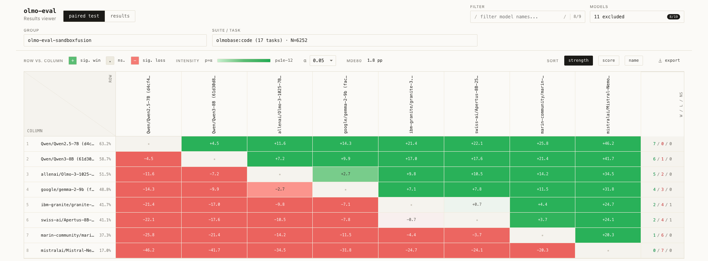
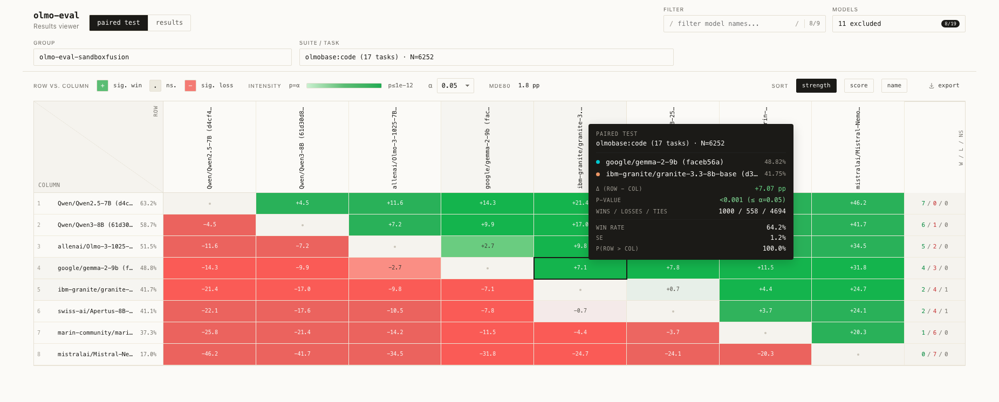
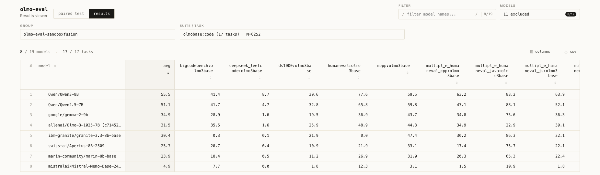

# Pairwise Analysis in the Results Viewer

`olmo-eval results viewer` is built around a paired comparison. The question is
not just "which run has the higher aggregate metric?" It is "on the shared
evaluation set, which run is better, what is the effect size, and how strong is
the statistical evidence?"

That distinction matters because aggregate scores can move for two reasons: the
models differ, or the evaluated instance sets differ. The paired analysis
removes the second source of variance by restricting every comparison to the
shared set of evaluated instances.

The screenshots in this README use a focused subset of models to keep the
examples readable.



## Why Use a Paired Comparison

For a pair of runs `A` and `B`, the viewer aligns their scores question by
question and works with the per-instance difference

```text
d_i = score(A, i) - score(B, i)
```

This is better than comparing unrelated aggregate means because shared instance
difficulty cancels out. If both models find the same examples easy and the same
examples hard, the covariance term is positive, so the variance of the paired
difference shrinks:

```text
Var(d_i) = Var(A_i) + Var(B_i) - 2 Cov(A_i, B_i)
```

That lower variance is the main benefit of pairing. It gives tighter uncertainty
estimates, smaller minimum detectable effects, and higher statistical power for
the same amount of evaluation data.

In practice, the paired test is most useful when:

- the same models were run on the same tasks and instances
- you care about head-to-head comparisons, not just raw scores
- you are running ablations under fixed compute or token budgets, where effect
  sizes are often small and you want to know whether those deltas are actually
  resolved
- you are comparing a coherent suite where pooling more shared instances is valid

## What the Viewer Shows

The viewer has two complementary surfaces:

- `paired test`: matched-pairs evidence from shared-instance comparisons
- `results`: absolute task-level scores for the current evaluation scope

Each heatmap cell shows `Δ (row - col)` on the shared slice. For percentage-like
metrics, `Δ` is shown in percentage points. The color direction shows who is
ahead. The color intensity shows how strongly that pair is resolved at the
current `α`. The detailed statistics live in the tooltip.

The results table is not another hypothesis test. It is the underlying score
surface that explains where the pairwise differences come from.

## The Math Behind One Cell

For each compared pair of runs, the analysis starts from the shared instance
set:

```text
n_shared = number of instances answered by both runs
```

For each shared instance, it computes

```text
d_i = score(A, i) - score(B, i)
```

and then classifies the instance as:

```text
A win   if d_i > margin
B win   if d_i < -margin
tie     if |d_i| <= margin
```

where `margin` is the tie threshold and defaults to `0`.

From that shared paired sample, the viewer reports two related summaries:

### 1. Effect Size on the Shared Evaluation Slice

The cell label is the score gap on the shared slice:

```text
Δ = mean(d_i)
```

For standard mean-based metrics such as accuracy, this is the same as the
difference between the two runs' average scores over the shared instances.

Interpret `Δ` as the size of the head-to-head gap, not as the strength of the
evidence. A small but stable difference and a larger but noisy difference are
both possible.

### 2. A Matched-Pairs Win Test

The tooltip also reports a sign-based paired test built from wins and losses:

```text
n_contested = wins_A + wins_B
p_hat       = wins_A / n_contested
```

Ties are excluded from the win-rate denominator. This is intentional. The test
asks: among the contested instances, how often did the row model win?

The viewer then uses a normal approximation to the matched-pairs sign test:

```text
SE(p_hat) = sqrt((n_contested / (n_contested - 1)) * p_hat * (1 - p_hat) / n_contested)
z         = (p_hat - 0.5) / SE(p_hat)
p_value   = 2 * (1 - Φ(|z|)) = erfc(|z| / sqrt(2))
P(A > B)  ≈ Φ(z)
```

where `Φ` is the standard normal CDF.

This produces the tooltip quantities:

- `wins / losses / ties`
- `win rate`
- `SE`
- `p-value`
- `P(row > col)`

The cell itself stays compact for scanning; the full statistical summary lives
in the tooltip.



## Matrix-Wide Precision: What `MDE80` Means

`MDE80` is the legend-level precision summary. It is not the p-value for one
cell. It answers a different question:

> for a typical model pair in this matrix, how small a true effect could this
> evaluation scope detect with 80% power at the current `α`?

The power helper uses:

```text
MDE80 = (z_(1-α/2) + z_(0.80)) *
        sqrt((ω² + σ_A² / K_A + σ_B² / K_B) / n_shared)
```

In the paired setting, the important term is the paired-difference variance.
For each compared pair we estimate:

```text
Var(d_i)
```

The viewer then uses the median paired variance across compared pairs as a
robust matrix-level estimate of noise before plugging it into the MDE formula.

Use `MDE80` as a readability check:

- lower `MDE80` means the matrix can resolve smaller true gaps
- higher `MDE80` means only larger effects are likely to separate cleanly
- `MDE80` is matrix-wide, so it is best used as context for the whole scope

A useful mental model is:

- `Δ` tells you the size of this pair's gap
- `p-value` tells you how decisively this pair separates
- `MDE80` tells you how well resolved the matrix is likely to be

## Interpretation Notes



The results tab answers a different question: "what were the underlying task
scores on this evaluation scope?" Use it to:

- inspect absolute task scores
- find tasks that explain a pairwise advantage
- check whether a model's paired wins come from broad consistency or one or two
  large task swings

A few details matter:

- in suite scope, each visible task column is one task inside the suite
- `avg` is the mean across the currently visible task columns
- in single-task scope, the viewer hides `avg` because it would duplicate the
  only visible task

Use the results table to understand where the paired result comes from. Use the
paired test to judge whether the head-to-head difference is actually resolved.

### Scope and Power

If a parent benchmark suite still measures the capability you care about, it is
usually the best place to run the paired analysis. More shared instances
usually lower the matrix MDE and make the head-to-head comparison easier to
resolve.

Do not pool unrelated capabilities just to inflate `N`. More instances only
help when the scope is still semantically coherent.

### Small Deltas Need a Sharp Matrix

A `+0.8 pp` cell in a matrix with `MDE80 = 8 pp` is usually not actionable. A
`+0.8 pp` cell in a matrix with `MDE80 = 1 pp` is worth taking seriously.

`MDE80` is not a hard cutoff for any one cell, but it is a very good guide to
whether the current scope can resolve the kind of effect you care about.

### Evidence vs. Effect Size

Color intensity reflects statistical evidence, not effect magnitude. Two cells
can have similar `Δ` but very different intensity if one pair is much noisier.

The most useful tooltip fields are:

- `N`: how many shared instances the pair is based on
- `Δ (row - col)`: the effect size on the shared slice
- `wins / losses / ties`: how much of the comparison is actually contested
- `p-value`: whether the contested win rate is resolved at the current `α`

### Ties and Contested Sample Size

When many instances are ties, `N` can be large while `n_contested` stays small.
That makes the contested win-rate test noisy.

This is why the tooltip shows both shared `N` and `wins / losses / ties`. A
pair with a large `N` but mostly ties may still provide weak evidence.

### Relative vs. Absolute Performance

These can disagree:

- one model to have a slightly higher average score on the scope
- but another model to win more contested head-to-head instances

That is not a contradiction. Magnitude and frequency are different summaries of
the same paired sample, and the viewer keeps both on purpose.

## Open and Export

Open the interactive viewer with:

```bash
olmo-eval results viewer -G <group> -S <suite>
```

Use a task instead of a suite when you want one exact scope:

```bash
olmo-eval results viewer -G <group> -t <task>
```

Dump the same viewer payload as JSON or CSV with:

```bash
olmo-eval results viewer -G <group> -S <suite> -f json
olmo-eval results viewer -G <group> -S <suite> -f csv
```

## See Also

- `pairwise.py` — pair construction, contested win-rate statistics, and shared-slice alignment
- `eval_power.py` — power and minimum detectable effect helpers
- Miller, "Adding Error Bars to Evals" (arXiv:2411.00640) — the general CLT and power framework behind these summaries
